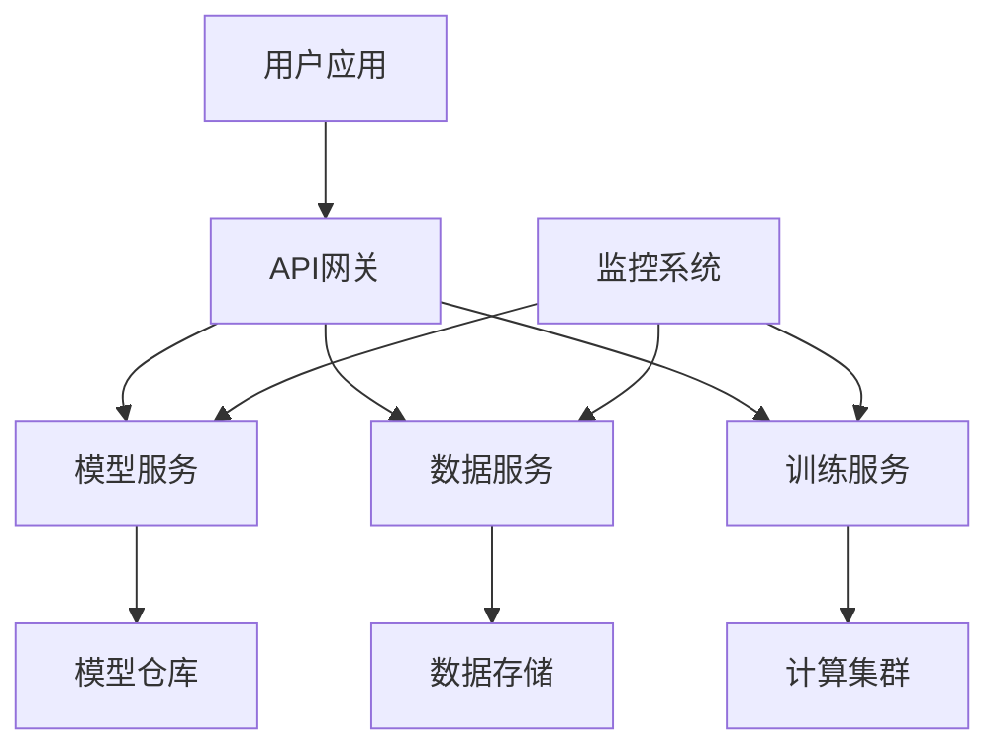

# 技术平台

锐境 AI Platform 是一个企业级的AI开发和部署平台，让AI应用开发变得简单高效。

---

## 平台概述

锐境 AI Platform 提供从数据准备、模型训练、模型部署到运维监控的全流程AI开发能力。

### 核心优势

<div class="grid cards" markdown>

-   :material-speedometer:{ .lg .middle } __快速开发__

    ---

    可视化界面，无需深厚的AI背景即可开发AI应用

-   :material-cloud:{ .lg .middle } __弹性扩展__

    ---

    自动扩缩容，按需付费，降低成本

-   :material-shield-check:{ .lg .middle } __企业级安全__

    ---

    多重安全保障，符合行业标准

-   :material-puzzle:{ .lg .middle } __易于集成__

    ---

    丰富的API和SDK，轻松集成到现有系统

</div>

---

## 平台功能

### 1. 数据管理

**数据标注**
- 图像标注工具
- 文本标注工具
- 音频标注工具
- 协同标注

**数据处理**
- 数据清洗
- 数据增强
- 数据转换
- 数据版本管理

**数据存储**
- 分布式存储
- 数据加密
- 访问控制
- 数据备份

---

### 2. 模型开发

**AutoML**
- 自动特征工程
- 自动模型选择
- 自动超参数优化
- 一键训练

**模型训练**
- 分布式训练
- GPU加速
- 训练监控
- 实验管理

**模型评估**
- 多指标评估
- 可视化分析
- A/B测试
- 模型对比

---

### 3. 模型部署

**一键部署**
- 容器化部署
- 无服务器部署
- 边缘部署
- 私有云部署

**版本管理**
- 模型版本控制
- 灰度发布
- 回滚机制
- 流量控制

**性能优化**
- 模型压缩
- 量化加速
- 批处理优化
- 缓存策略

---

### 4. 运维监控

**性能监控**
- 实时监控
- 性能指标
- 资源使用
- 成本分析

**日志管理**
- 日志收集
- 日志分析
- 日志检索
- 日志归档

**告警通知**
- 自定义告警规则
- 多渠道通知
- 告警聚合
- 故障自愈

---

## 使用流程

### 步骤1：数据准备

```python
from ruijing_ai import Platform

# 初始化平台
platform = Platform(api_key="your_key")

# 上传数据
dataset = platform.datasets.create(
    name="my_dataset",
    type="image_classification"
)

dataset.upload_files("./data/")
```

### 步骤2：模型训练

```python
# 创建训练任务
training_job = platform.training.create(
    dataset_id=dataset.id,
    model_type="image_classification",
    config={
        "epochs": 10,
        "batch_size": 32,
        "learning_rate": 0.001
    }
)

# 等待训练完成
training_job.wait()
```

### 步骤3：模型部署

```python
# 部署模型
deployment = platform.deployments.create(
    model_id=training_job.model_id,
    name="my_model",
    instance_type="gpu.small"
)

# 获取API端点
endpoint = deployment.endpoint_url
```

### 步骤4：模型调用

```python
# 调用部署的模型
result = platform.predict(
    endpoint=endpoint,
    data={"image_url": "https://example.com/image.jpg"}
)

print(result)
```

---

## 平台架构



---

## 技术特性

### 高性能计算

- **GPU加速**：支持NVIDIA GPU加速
- **分布式训练**：多机多卡并行训练
- **混合精度**：FP16/BF16混合精度训练
- **梯度累积**：支持大batch训练

### 弹性伸缩

- **自动扩容**：根据负载自动扩容
- **负载均衡**：智能流量分配
- **资源调度**：高效的资源利用
- **成本优化**：按需付费，降低成本

### 安全保障

- **数据加密**：传输和存储加密
- **访问控制**：细粒度权限管理
- **审计日志**：完整的操作记录
- **合规认证**：ISO 27001认证

---

## 支持的框架

<div class="framework-grid" markdown>

### 深度学习框架

- TensorFlow
- PyTorch
- Keras
- MXNet
- PaddlePaddle

### 机器学习框架

- Scikit-learn
- XGBoost
- LightGBM
- CatBoost

### 其他工具

- Jupyter Notebook
- TensorBoard
- MLflow
- Kubeflow

</div>

---

## 定价方案

### 计算资源

| 实例类型 | 配置 | 价格 |
|---------|------|------|
| cpu.small | 2核4G | ¥0.5/小时 |
| cpu.large | 8核16G | ¥2/小时 |
| gpu.small | T4 GPU | ¥5/小时 |
| gpu.large | V100 GPU | ¥15/小时 |

### 存储资源

| 类型 | 价格 |
|------|------|
| 对象存储 | ¥0.1/GB/月 |
| 块存储 | ¥0.5/GB/月 |

### 网络流量

| 类型 | 价格 |
|------|------|
| 入站流量 | 免费 |
| 出站流量 | ¥0.5/GB |

[查看详细定价 :material-currency-usd:](https://app.ruijing.ai/pricing){ .md-button }

---

## 快速开始

<div class="grid cards" markdown>

-   :material-rocket-launch:{ .lg .middle } __5分钟快速入门__

    ---

    快速了解平台基本功能

    [:octicons-arrow-right-24: 开始教程](../docs/getting-started.md)

-   :material-book-open:{ .lg .middle } __完整文档__

    ---

    详细的平台使用文档

    [:octicons-arrow-right-24: 查看文档](../docs/api.md)

-   :material-code-braces:{ .lg .middle } __示例项目__

    ---

    丰富的示例代码和项目

    [:octicons-arrow-right-24: GitHub](https://github.com/ruijing-ai/examples)

-   :material-forum:{ .lg .middle } __社区支持__

    ---

    加入开发者社区

    [:octicons-arrow-right-24: 加入社区](../about/index.md)

</div>

---

## 客户案例

!!! success "某互联网公司"

    使用Ruijing AI Platform构建推荐系统，开发周期从3个月缩短到2周，模型性能提升30%。

!!! success "某制造企业"

    部署视觉检测系统，检测准确率达到99%，人工成本降低70%。

[查看更多案例 :material-arrow-right:](cases.md){ .md-button }

---

## 立即体验

<div class="cta-section" markdown>

### 开始使用 锐境 AI Platform

免费试用，快速构建您的AI应用！

[免费试用 :material-rocket:](https://app.ruijing.ai/signup){ .md-button .md-button--primary .md-button--large }
[预约演示 :material-presentation:](../about/index.md){ .md-button .md-button--large }

</div>

---

*让AI开发变得简单高效！*
